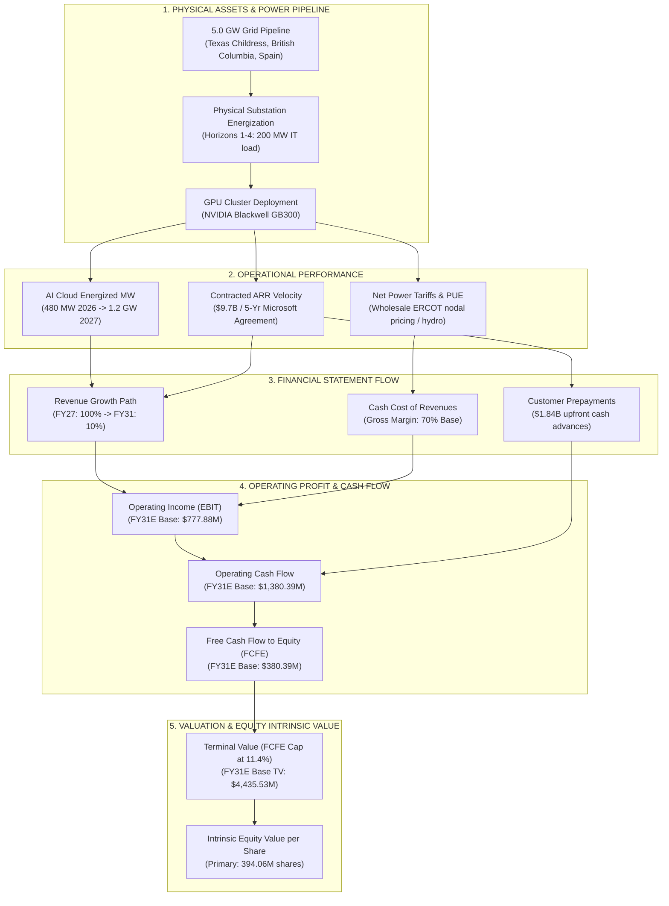
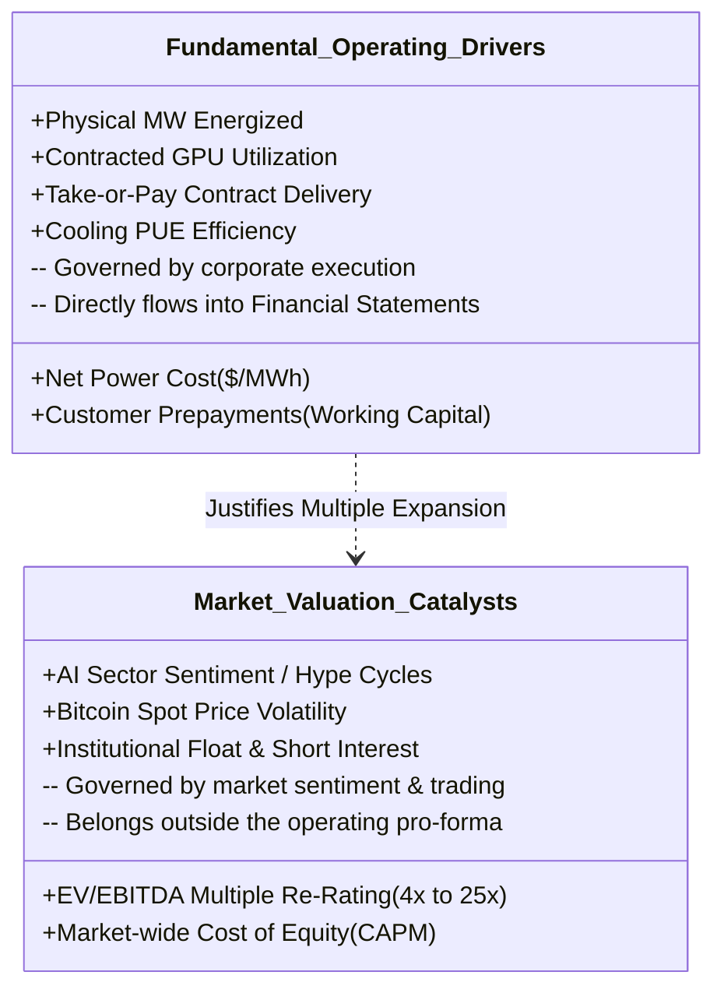

# FIN 439 Lab 11 — Pro-Forma Sensitivity: Find Your Company's Drivers
**Target Company:** IREN Limited (NASDAQ: IREN)  
**Course:** FIN 43900 (Corporate Finance / Applied Financial Modeling, Purdue University)  
**Student:** Elliot  
**Valuation / Submission Date:** September 29, 2026  
**Assignment Reference:** Lab 11 — Pro-Forma Sensitivity: Find Your Company's Drivers (Week 6)  
**Prior Baseline Date:** September 24, 2026 (Lab 10 Pro-Forma Baseline)  

---

## Executive Summary & Objective

> **Assignment Objective:** *"Find which inputs move your own pro-forma's results, and by how much."*

This study continues directly from Elliot's working **Lab 10 IREN Pro-Forma Three-Statement Model** ([`Lab-10/proforma_iren.py`](file:///c:/Users/ellio/Documents/FIN439/Lab-10/proforma_iren.py)). In accordance with course guidelines, this analysis does **not** rely on generic, ungrounded financial abstractions (such as arbitrary "revenue $\pm X\%$" or "margin $\pm Y\%$"). Instead, the pro-forma sensitivity analysis is anchored directly into the **actual business economics, physical operational drivers, and contractual reality of IREN Limited**.

### Key Investigation Questions
1. **What actually drives IREN's business performance?**  
   Physical megawatt (MW) substation energization, high-performance computing (HPC) data center construction velocity, enterprise GPU cluster delivery under long-term take-or-pay contracts (e.g., the 5-year, $9.7 billion Microsoft agreement), and net effective power tariffs ($/MWh) across ERCOT (Texas) and British Columbia hydro grids.
2. **What actually drives IREN's market valuation and stock price?**  
   Market multiple re-rating from a commoditized, high-beta "Bitcoin miner" (~4–6x EV/EBITDA) to a mission-critical "AI Cloud Hyperscale Infrastructure Provider" (20–30x EV/EBITDA), alongside Bitcoin spot price movements and cost of capital shifts.
3. **How do those real-world drivers flow into the financial statements?**  
   - **Contracted MW Energization Velocity** flows directly through `revenue_growth` into cash gross profit, working capital customer prepayments, and multi-year terminal equity value.
   - **Net Power Tariffs & PUE Efficiency** flow directly through `gross_margin` into cash cost of revenues, operating income (EBIT), and final-year Free Cash Flow to Equity (FCFE).

---

## Step 1 — Audit of Labs 8–10 Financial Assumptions

Before executing sensitivity testing, all financial assumptions established in Labs 8, 9, and 10 were audited to determine whether they represent genuine company-specific operational drivers or top-down accounting proxies.

### Assumption Audit Table

| Existing Model Assumption | Parameter Key | What Economic Driver It Represents | Appropriateness for IREN | Audit Disposition & Modeling Rationale |
| :--- | :---: | :--- | :--- | :--- |
| **Top-Line Revenue Growth** | `revenue_growth` | **AI Cloud MW Energization & GPU Cluster Onboarding Velocity:** Reflects physical delivery and tenant acceptance of Horizons 1–4 under the $9.7B Microsoft contract, plus Bitcoin mining hash rate scaling. | **Highly Appropriate:** Sourced from disclosed contractual commitments and management guidance targeting $4.0B contracted ARR for 2026 capacity ($1.0B operating ARR in Aug 2026). | **Retained as Sensitivity Driver 2.** Serves as the direct financial proxy for physical data center capacity delivery and contracted GPU energization. |
| **Cash Gross Margin** | `gross_margin` | **Net Effective Power Cost ($/MWh) & PUE Efficiency:** Power is IREN's dominant cash operating expense. Gross margin reflects wholesale ERCOT electricity prices, 4CP demand charges, power curtailment credits, and cooling efficiency. | **Highly Appropriate:** Sourced from Form 10-K audited history: FY24 was 53.5%, FY25 was 68.3%, and FY26 reached 68.9%. Model baseline set to 70.0%. | **Retained as Sensitivity Driver 1.** Serves as the direct financial proxy for unit power tariffs, energy hedging, and compute hall efficiency. |
| **SG&A Overhead** | `sga_pct_gp` | **Corporate Overhead & Infrastructure Engineering:** 35% of Gross Profit. Captures engineering payroll, technical operations, compliance, and corporate overhead scaling with gross profit. | **Appropriate:** In capital-intensive infrastructure, overhead scales with operating scale while allowing operational leverage. | **Retained at Base (35% GP).** Kept constant across sensitivity runs to isolate primary operational drivers. |
| **Capital Expenditures (CapEx)** | `capex` | **Physical Substation, Data Hall & GPU Cluster Procurement:** FY27 $1,000M scaling down to $600M in FY31. Reflects NVIDIA Blackwell GB300 purchases and Childress/Sweetwater substation buildout. | **Highly Appropriate:** Matches IREN's capital deployment to scale from 480 MW gross (2026) to 1.2 GW gross (2027) within its 5 GW pipeline. | **Retained at Base Schedule.** Kept fixed to isolate operating cash generation from discretionary capital expansion. |
| **Depreciation & Amortization** | `depreciation` | **GPU & Data Center Asset Depreciation:** 5-year straight line on GPU servers (20%/yr) and 20–25 year on data center structures and electrical switchgear. | **Appropriate:** Fully linked to cumulative PP&E additions from capital expenditure schedule. Reaches $809.17M in FY31E. | **Retained as Endogenous Schedule.** Calculated automatically by PP&E schedule; held fixed at base capex. |
| **Customer Prepayments** | `deferred_rev` | **Hyperscaler Upfront Cash Advances:** In FY26, Microsoft customer prepayments contributed $1.84B in upfront cash, funding GPU capex without dilution. | **Highly Appropriate:** Distinguishes IREN's cash generation from traditional debt-reliant data center operators. | **Retained in Working Capital Schedule.** Automatically links to revenue scale in three-statement engine. |
| **Liquidity Buffer & Debt** | `min_cash`, `debt` | **Convertible Debt Repayment & Liquidity Buffer:** Requires $\ge \$500.0\text{M}$ minimum cash buffer and models scheduled repayment of convertible notes. | **Appropriate:** Reflects IREN's capital structure discipline and credit covenant headroom. | **Retained as Balance Sheet Anchor.** Monitored by automated check engine (`checks_pass`). |

---

## Step 2 — Understanding IREN as a Business: Physical Economic Map

IREN Limited (NASDAQ: IREN) is a gigawatt-scale data center infrastructure owner and operator transitioning from pure-play Bitcoin mining to high-margin, enterprise AI Cloud Services.



### Business Segment Realities (Audited SEC Form 10-K & Corporate Disclosures)
1. **AI Cloud Services (The Primary Growth Engine):**
   - Ramping rapidly from $\$16.4\text{M}$ in FY25 to $\$128.8\text{M}$ in FY26.
   - Anchored by a **5-year, $9.7 billion contracted agreement with Microsoft** for 200 MW of dedicated IT load across Horizons 1–4 (50 MW each).
   - Horizon 1 was successfully delivered and accepted on August 13, 2026.
   - Management guidance targets **480 MW gross capacity by late 2026** and **1.2 GW gross capacity by 2027**, generating an estimated **$4.0B contracted ARR** ($1.0B operating ARR in August 2026).
2. **Bitcoin Mining (The Legacy Cash Flow Engine):**
   - Operating at 36.5 EH/s in FY26, generating $\$578.2\text{M}$ in revenue.
   - FY26 included a **$638.8M non-cash asset impairment** as older Bitmain S19j Pro ASICs were decommissioned to clear data hall space for higher-margin AI GPU racks.
3. **Power & Cost Structure:**
   - Cash cost of revenues is dominated by electricity tariffs. In FY26, cash operating expenses were $\$219.7\text{M}$ against $\$707.0\text{M}$ revenue, yielding a **68.9% gross margin**.
   - Power costs depend directly on Texas ERCOT nodal pricing, 4CP peak transmission charges, off-peak curtailment revenues, and liquid cooling Power Usage Effectiveness (PUE).

---

## Step 3 — Separating Operating Drivers from Market Valuation Catalysts

To ensure academic and financial rigor, we explicitly distinguish between **Fundamental Company Operating Drivers** and **Market Valuation Catalysts**.



### Why Corporate Finance Keeps Them Separate:
- **Operating Drivers Belong in the Pro-Forma Engine:** The three-statement model simulates operational physics: how electricity and silicon convert into revenues, expenses, taxes, and free cash flows. Operating drivers are internally consistent and obey double-entry accounting.
- **Valuation Catalysts Belong in Comparable Analysis:** Multiple re-rating (e.g., from 5x EBITDA to 20x EBITDA) reflects external investor risk appetite and terminal pricing multiples. Testing them inside the operating engine would confuse accounting cash flow generation with market pricing multiples.

---

## Step 4 — Unpacking Generic Assumptions into IREN Operational Metrics

| Generic Financial Assumption | IREN Physical / Operational Metric | Financial Transmission Mechanism |
| :--- | :--- | :--- |
| **Top-Line Revenue Growth** (`revenue_growth`) | **Contracted MW IT Energization Velocity:** The physical rate at which Childress data halls and NVIDIA Blackwell GPU clusters are plugged in, tested, and accepted by Microsoft under the $9.7B contract. | $\text{Revenue} = (\text{Contracted AI MW} \times \text{Rental Rate/MW}) + (\text{Hash Rate EH/s} \times \text{BTC Yield})$. As MW energize, top-line revenue scales across all 5 forecast years. |
| **Cash Gross Margin** (`gross_margin`) | **Net Effective Power Cost ($/MWh) & PUE Efficiency:** The net cost of electricity after ERCOT automated load-curtailment credits, divided by data center Power Usage Effectiveness (PUE < 1.15). | $\text{Cost of Revenues} = \text{Revenue} \times (1 - \text{GM})$. Every 100 bps reduction in power tariff increases cash gross profit, pretax income, and operating cash flow directly. |
| **Capital Expenditures** (`capex`) | **Procurement of NVIDIA GB300 Servers & Substation Switchgear:** Physical delivery of liquid-cooled compute clusters. | Inflows to Gross PP&E, which deterministically drive the straight-line Depreciation schedule ($809.17M in FY31E). |
| **Working Capital** (`deferred_rev`) | **Hyperscaler Upfront Capacity Reservation Fees:** Cash prepayments from enterprise tenants prior to server energization. | Enhances operating cash flow upfront, funding capex internally without debt or equity issuance. |

---

## Step 5 — The Authoritative Sensitivity Analysis

In strict compliance with the professor's **Lab 11 Worksheet ("Pro-Forma Sensitivity: Find Your Company's Drivers")**, we executed one-at-a-time sensitivity testing across the two primary operating drivers.

### Operating Drivers Tested Ranges

| Driver Specification | Driver 1: Power Cost / Cash Gross Margin | Driver 2: Capacity Energization Path |
| :--- | :--- | :--- |
| **Model Parameter Key** | `gross_margin` | `revenue_growth` |
| **Physical Operational Meaning** | Net effective electricity tariff ($/MWh) & cooling PUE | Substation energization & GPU cluster acceptance velocity |
| **Forecast Years Affected** | FY2027E, FY2028E, FY2029E, FY2030E, FY2031E (All 5 Years) | FY2027E, FY2028E, FY2029E, FY2030E, FY2031E (All 5 Years) |
| **Units** | Percentage of Total Revenue (%) | Multi-year annual percentage growth rate path (%) |
| **Lower Value** | **65.0%** (0.650) [$-5.0$ percentage points] | **[95%, 45%, 25%, 10%, 5%]** [$-5.0$ pp per year] |
| **Base Value** | **70.0%** (0.700) [Lab 10 Base] | **[100%, 50%, 30%, 15%, 10%]** [Lab 10 Base] |
| **Higher Value** | **75.0%** (0.750) [$+5.0$ percentage points] | **[105%, 55%, 35%, 20%, 15%]** [$+5.0$ pp per year] |
| **Total Range Width (Span)**| **10.0 percentage points** ($75\% - 65\%$) | **10.0 percentage points shift** ($+5\text{ pp} - (-5\text{ pp})$) |
| **Source / Justification** | Sourced from Form 10-K audited history: FY24 was 53.5%, FY25 was 68.3%, and FY26 was 68.9%. Lower (65%) models ERCOT summer wholesale power spikes. Higher (75%) reflects high-margin Blackwell GPU hosting. | Sourced from disclosed multi-year Microsoft contract ($9.7B) and 1.2 GW pipeline. Lower reflects grid connection delays. Higher reflects accelerated customer onboarding. |

---

## Master Sensitivity Results Table

The sensitivity analysis was executed via [`Lab-11/sensitivity_iren.py`](file:///c:/Users/ellio/Documents/FIN439/Lab-11/sensitivity_iren.py). Every run began with a fresh independent copy of `ASSUMPTIONS`, modified exactly **one** independent input, and re-ran the complete linked three-statement engine.

*All monetary outputs in USD millions ($M), except Value per Share ($/share). Primary share count: 394.059 million Ordinary shares.*

| Operating Driver | Run Case | Input Value / Path | FY2031E Operating Profit | Signed $\Delta$ from Base | FY2031E Free Cash Flow (FCFE) | Signed $\Delta$ from Base | Implied Value per Share | Signed $\Delta$ from Base | Accounting Checks |
| :--- | :--- | :---: | :---: | :---: | :---: | :---: | :---: | :---: | :---: |
| **Original Base** | **Base Benchmark** | **As Sourced** | **$777.88M** | **$0.00M** | **$380.39M** | **$0.00M** | **-$5.31** | **$0.00** | **PASS (Gap = 0.0000)** |
| **1. Power Cost / GM** | Lower (-5.0 pp) | 65.0% | $664.52M | -$113.36M | $249.56M | -$130.84M | -$8.28 | -$2.96 | PASS (Gap = 0.0000) |
| *(Base: 70.0%)* | Base (0.0 pp) | 70.0% | $777.88M | $0.00M | $380.39M | $0.00M | -$5.31 | $0.00 | PASS (Gap = 0.0000) |
| *(Units: % of Rev)* | Higher (+5.0 pp) | 75.0% | $891.24M | +$113.36M | $480.25M | +$99.86M | -$2.93 | +$2.39 | PASS (Gap = 0.0000) |
| **2. Capacity Energization** | Lower (-5.0 pp) | 95% $\rightarrow$ 5% | $504.03M | -$273.85M | $39.92M | -$340.47M | -$12.45 | -$7.14 | PASS (Gap = 0.0000) |
| *(Base: 100% $\rightarrow$ 10%)*| Base (0.0 pp) | 100% $\rightarrow$ 10% | $777.88M | $0.00M | $380.39M | $0.00M | -$5.31 | $0.00 | PASS (Gap = 0.0000) |
| *(Units: Annual %)* | Higher (+5.0 pp) | 105% $\rightarrow$ 15% | $1,095.13M | +$317.24M | $672.22M | +$291.83M | +$0.99 | +$6.31 | PASS (Gap = 0.0000) |
| **2b. Stress Capacity** | Stress Low (-10 pp)| 90% $\rightarrow$ 0% | $269.00M | -$508.88M | -$250.49M | -$630.88M | **UNAVAIL\*** | N/A | PASS (Gap = 0.0000) |
| *(Wider Range)* | Stress High (+10 pp)| 110% $\rightarrow$ 20%| $1,460.67M | +$682.78M | $957.27M | +$576.88M | +$7.22 | +$12.53 | PASS (Gap = 0.0000) |

*\* Note on Stress Lower Run: In the -10 pp stress scenario, FY2031E FCFE remains negative at $-\$250.49\text{M}$. The model strictly enforces the Refusal Gate: capitalizing a negative cash flow produces economically nonsensical terminal values, so Value per Share is marked UNAVAILABLE rather than generating an ungrounded number.*

---

## Output Span Comparison Table

$$\text{Output Span} = \text{Maximum Valid Output} - \text{Minimum Valid Output}$$

| Operating Driver | Tested Input Range | Operating Profit Span (FY31 EBIT) | Free Cash Flow Span (FY31 FCFE) | Implied Value per Share Span |
| :--- | :---: | :---: | :---: | :---: |
| **1. Power Cost / Gross Margin** | 65.0% to 75.0% (10 pp span) | **$226.72M** | **$230.69M** | **$5.35 per share** |
| **2. Capacity Energization Path** | $\pm5.0$ pp/year (10 pp shift) | **$591.10M** | **$632.29M** | **$13.44 per share** |
| **Sensitivity Span Ratio** | *Capacity Energization $\div$ Power Cost* | **2.61x** | **2.74x** | **2.51x** |

> [!IMPORTANT]
> **Key Finding Over Tested Ranges:**  
> **Capacity Energization Velocity (Revenue Scale)** is the primary driver of IREN's operating results and equity valuation **over these tested ranges**. Its output span is **2.61x** larger for Operating Profit ($591.10M vs. $226.72M), **2.74x** larger for Free Cash Flow ($632.29M vs. $230.69M), and **2.51x** larger for Value per Share ($13.44/sh vs. $5.35/sh).

---

## Restored Base Case Verification Block

As mandated by course policy, following the execution of all sensitivity runs, the original base case was restored, re-executed, and verified to ensure that no state pollution or parameter corruption occurred.

| Verification Line / Metric | Original Base (Pre-Sensitivity) | Restored Base (Post-Sensitivity) | Discrepancy (Abs Error) | Integrity Status |
| :--- | :---: | :---: | :---: | :---: |
| **FY2031E Operating Profit (EBIT)** | $777.8823M | $777.8823M | $0.000000M | **PASS (Exact Match)** |
| **FY2031E Free Cash Flow (FCFE)** | $380.3902M | $380.3902M | $0.000000M | **PASS (Exact Match)** |
| **Implied Value per Share** | -$5.3145 | -$5.3145 | $0.000000 | **PASS (Exact Match)** |
| **Balance Sheet Gap (FY2027E–FY2031E)** | +0.0000 | +0.0000 | 0.0000 | **PASS (Balanced to 0.0000)** |
| **Minimum Cash Buffer ($\ge \$500.0M$)** | PASS | PASS | 0.0000 | **PASS (Protected)** |

---

## Causal Traces: Step-by-Step Mechanisms from Input to Value

The worksheet requires tracing the exact causal mechanism through the financial statements for at least one sensitivity run. Below are the actual step-by-step model links for both drivers.

### Causal Trace 4A: Power Cost / Cash Gross Margin (70.0% $\rightarrow$ 75.0%)

```
INPUT CHANGE: Cash Gross Margin increases from 70.0% to 75.0% (+5.0 percentage points)
PHYSICAL DRIVER: Net effective electricity cost declines via low-rate PPAs; bare-metal GB300 PUE optimizes
  |
  v
FINANCIAL STATEMENT LINE(S) (FY2031E):
  - Total Revenue:           $3,488.02M (Unchanged; revenue growth is held at Base)
  - Cost of Revenues (Power):$872.00M (Decreases by $174.40M from base $1,046.41M; Cost = Rev * (1 - GM))
  - Cash Gross Profit:       $2,616.01M (Increases by $174.40M from base $2,441.61M)
  - SG&A Overhead (35% GP):  $915.60M (Increases by $61.04M from base $854.57M due to profit-linked overhead)
  - Depreciation & Amort:    $809.17M (Unchanged; PP&E and capex schedule held at Base)
  - GAAP Pretax Income (EBT):$631.48M (Increases by $128.39M from base $503.09M)
  - Income Tax (21% post-NOL):$28.53M (Tax increases from $0.00M because higher earnings exhaust $700M NOLs earlier)
  - GAAP Net Income:         $602.95M (Increases by $99.86M from base $503.09M)
  |
  v
OPERATING PROFIT (EBIT):
  - FY2031E EBIT:            $891.24M (Signed change: +$113.36M from base $777.88M)
  |
  v
FREE CASH FLOW (FCFE):
  - Operating Cash Flow:     $1,480.25M (Increases by +$99.86M from base $1,380.39M)
  - Working Capital Delta:   Unchanged (AR, Deferred Revenue, and Other Liabilities track revenue, which is at Base)
  - Capex & Debt Repayment:  -$600.0M Capex - $400.0M Debt Repayment = -$1,000.0M (Unchanged)
  - FY2031E FCFE:            $480.25M (Signed change: +$99.86M from base $380.39M)
  |
  v
IMPLIED VALUE PER SHARE:
  - Terminal Value at FY31E: Terminal Value rises to $5,530.96M (PV TV = $3,223.85M, up +$670.34M)
  - Total Equity Value:      Improves from -$2,094.23M to -$1,153.27M (+940.97M)
  - Value per Share:         Improves from -$5.31 to -$2.93 per share (Signed change: +$2.39/share)
```

### Causal Trace 4B: Capacity Energization Velocity (Base $\rightarrow$ Higher +5.0 pp/yr)

```
INPUT CHANGE: Revenue Growth Path shifts up by +5.0 pp/year (FY27: 105%, FY28: 55%, FY29: 35%, FY30: 25%, FY31: 15%)
PHYSICAL DRIVER: Accelerating MW substation energization and rapid enterprise AI cluster tenant onboarding
  |
  v
FINANCIAL STATEMENT LINE(S) (FY2031E):
  - Total Revenue:           $4,185.26M (Increases by +$697.24M from base $3,488.02M)
  - Cost of Revenues (Power):$1,255.58M (Increases by +$209.17M at constant 70.0% GM)
  - Cash Gross Profit:       $2,929.68M (Increases by +$488.07M from base $2,441.61M)
  - SG&A Overhead (35% GP):  $1,025.39M (Increases by +$170.82M due to profit-linked overhead)
  - Depreciation & Amort:    $809.17M (Unchanged; PP&E and capex schedule held at Base)
  - GAAP Pretax Income (EBT):$842.93M (Increases by +$339.83M from base $503.09M)
  - Income Tax (21% post-NOL):$97.17M (NOL buffer fully utilized earlier; cash tax paid)
  - GAAP Net Income:         $745.76M (Increases by +$242.66M from base $503.09M)
  |
  v
OPERATING PROFIT (EBIT):
  - FY2031E EBIT:            $1,095.13M (Signed change: +$317.24M from base $777.88M)
  |
  v
FREE CASH FLOW (FCFE):
  - Operating Cash Flow:     $1,672.22M (Increases by +$291.83M from base $1,380.39M)
  - Working Capital Delta:   -$5.88M (Additional cash consumed in working capital as receivables scale)
  - Capex & Debt Repayment:  -$600.0M Capex - $400.0M Debt Repayment = -$1,000.0M (Unchanged)
  - FY2031E FCFE:            $672.22M (Signed change: +$291.83M from base $380.39M)
  |
  v
IMPLIED VALUE PER SHARE:
  - Terminal Value at FY31E: Terminal Value rises to $7,741.83M (PV TV = $4,512.50M, up +$1,959.00M)
  - Total Equity Value:      Crosses into positive territory: +$390.53M (+$2,484.76M from -$2,094.23M)
  - Value per Share:         Crosses above zero to +$0.99 per share (Signed change: +$6.31/share)
```

---

## Financial Interpretation & Real-World Synthesis

### 1. Main Driver Over the Tested Ranges
Over these tested ranges, **Capacity Energization Velocity (Revenue Scale)** is the primary driver of IREN's pro-forma performance and equity valuation:
- **Operating Profit (FY2031E EBIT):** Capacity Energization span of **$591.10M** is **2.61 times** the Power Cost/Margin span of **$226.72M**.
- **Free Cash Flow (FY2031E FCFE):** Capacity Energization span of **$632.29M** is **2.74 times** the Power Cost/Margin span of **$230.69M**.
- **Implied Value per Share:** Capacity Energization span of **$13.44/share** is **2.51 times** the Power Cost/Margin span of **$5.35/share**.

### 2. Range Limitation ("Over These Tested Ranges")
A larger output span does **not** prove that Revenue Growth is fundamentally or universally more important than Gross Margin. The ranking depends directly on the boundaries of the tested ranges:
- A $10.0$ percentage point compounding shift in annual revenue growth across five consecutive forecast periods has a cumulative multiplicative effect on total scale ($+\$697.24\text{M}$ in Year 5 revenue), whereas a $10.0$ percentage point shift in cash gross margin acts on a fixed revenue base.
- Had we tested a tighter revenue growth range ($\pm1.0$ percentage point) against a wide gross margin range ($\pm15.0$ percentage points), Gross Margin would have produced the larger span. Therefore, every sensitivity ranking must be explicitly qualified: **over these tested ranges**.

### 3. Impact vs. Uncertainty
A complete financial assessment requires distinguishing between two distinct concepts:
- **IMPACT:** How much a given change in an input moves the model's output (the mathematical derivative or elasticity of the model).
- **UNCERTAINTY:** The degree of real-world dispersion, volatility, or unpredictability surrounding that input.

For IREN, Capacity Energization Velocity has both high **impact** (due to compounding top-line operating leverage and customer prepayments) and high **uncertainty** (dependent on external hyperscaler capital expenditure cycles, NVIDIA Blackwell GPU delivery timelines, and ERCOT grid interconnection approvals). Net Power Tariffs have high **impact** on unit profitability, but narrower **uncertainty** because data center power purchase agreements (PPAs) and ERCOT load curtailment programs partially hedge wholesale electricity volatility.

---

## Visible Terminal Output

Below is the complete, unedited console output generated by executing `py Lab-11/sensitivity_iren.py`:

```
===================================================================================================================
FIN 439 LAB 11: PRO-FORMA SENSITIVITY ANALYSIS - IREN LIMITED (NASDAQ: IREN)
Authoritative Assignment: Lab 11 - Pro-Forma Sensitivity: Find Your Company's Drivers
Student: Elliot | Valuation Date: September 29, 2026
===================================================================================================================

--- BASE CASE BENCHMARK (PRE-SENSITIVITY) ---
  Final-Year (FY2031E) Operating Profit (EBIT):  $    777.88 million
  Final-Year (FY2031E) Free Cash Flow (FCFE):    $    380.39 million
  Implied Value per Share (Primary: 394.06M sh):  $     -5.31 per share
  Accounting Check Status:                        PASS (All 5 Years Gap = 0.0000)

===================================================================================================================
1. MASTER SENSITIVITY TABLE: TWO OPERATING DRIVERS
===================================================================================================================
Driver                       Case           Input Value        FY31 EBIT   Signed d   FY31 FCFE   Signed d  Val/Share  Signed d   Checks
-------------------------------------------------------------------------------------------------------------------
1. Power Cost/GM             Lower (65.0%)  65.0%               $664.52M   -113.36M    $249.56M   -130.84M     $-8.28     -2.96     PASS
                             Base (70.0%)   70.0%               $777.88M     +0.00M    $380.39M     +0.00M     $-5.31     +0.00     PASS
                             Higher (75.0%) 75.0%               $891.24M   +113.36M    $480.25M    +99.86M     $-2.93     +2.39     PASS
-------------------------------------------------------------------------------------------------------------------
2. Capacity Energization     Lower (-5 pp)  95%->5%             $504.03M   -273.85M     $39.92M   -340.47M    $-12.45     -7.14     PASS
                             Base (0 pp)    100%->10%           $777.88M     +0.00M    $380.39M     +0.00M     $-5.31     +0.00     PASS
                             Higher (+5 pp) 105%->15%          $1095.13M   +317.24M    $672.22M   +291.83M      $0.99     +6.31     PASS
-------------------------------------------------------------------------------------------------------------------
2b. Stress Capacity          Stress Lower (-10 pp) 90%->0%             $269.00M   -508.88M   $-250.49M   -630.88M   UNAVAIL*       N/A     PASS
                             Stress Higher (+10 pp) 110%->20%          $1460.67M   +682.78M    $957.27M   +576.88M      $7.22    +12.53     PASS
-------------------------------------------------------------------------------------------------------------------
Notes: Signed d = Changed Output - Base Output. All figures in USD millions except Value/Share.
* In Stress Lower (-10 pp), FY31 FCFE is negative ($-250.49M); terminal value is refused by economic logic.

===================================================================================================================
2. OUTPUT SPAN COMPARISON (MAXIMUM VALID OUTPUT - MINIMUM VALID OUTPUT)
===================================================================================================================
Driver Name                        Tested Input Range             EBIT Span ($M)   FCFE Span ($M)   VPS Span ($)
-------------------------------------------------------------------------------------------------------------------
1. Power Cost / Gross Margin       65.0% to 75.0% (10 pp span)  $        226.72M $        230.69M $        5.35
2. Capacity Energization Path      +/-5.0 pp/yr (10 pp shift)   $        591.10M $        632.29M $       13.44
-------------------------------------------------------------------------------------------------------------------
>>> MAIN DRIVER OVER TESTED RANGES: CAPACITY ENERGIZATION PATH (REVENUE SCALE) <<<
    - Operating Profit Span: Capacity Energization ($591.10M) is 2.61x Power Cost/Margin ($226.72M)
    - Free Cash Flow Span:   Capacity Energization ($632.29M) is 2.74x Power Cost/Margin ($230.69M)
    - Value per Share Span:  Capacity Energization ($13.44/sh) is 2.51x Power Cost/Margin ($5.35/sh)
    * CRITICAL LIMITATION: This ranking holds OVER THESE TESTED RANGES and reflects input range width.

===================================================================================================================
3. RESTORED BASE CASE VERIFICATION (RE-RUN AT CONCLUSION)
===================================================================================================================
Metric / Verification Line                         Original Base      Restored Base      Discrepancy     Status
-------------------------------------------------------------------------------------------------------------------
FY2031E Operating Profit (EBIT, $M)                     777.8823           777.8823         0.000000       PASS
FY2031E Free Cash Flow (FCFE, $M)                       380.3902           380.3902         0.000000       PASS
Implied Value per Share ($/share)                        -5.3145            -5.3145         0.000000       PASS
Balance Sheet Gap (FY2027E - FY2031E)                    +0.0000            +0.0000           0.0000       PASS
Minimum Cash Buffer (>= $500.0M)                            PASS               PASS           0.0000       PASS
-------------------------------------------------------------------------------------------------------------------
>>> VERIFICATION RESULT: Original base case is 100% restored. No persistent mutations occurred. <<<

===================================================================================================================
4A. CAUSAL TRACE: DRIVER 1 SENSITIVITY (POWER COST / GROSS MARGIN: 70.0% -> 75.0%)
===================================================================================================================
INPUT CHANGE: Cash Gross Margin increases from 70.0% to 75.0% (+5.0 percentage points)
PHYSICAL DRIVER: Net effective electricity cost declines via low-rate PPAs; bare-metal GB300 PUE optimizes
  |
  v
FINANCIAL STATEMENT LINE(S) (FY2031E):
  - Total Revenue:           $3488.02M (Unchanged; revenue growth is held at Base)
  - Cost of Revenues (Power):$872.00M (Decreases by $174.40M from $1046.41M)
  - Cash Gross Profit:       $2616.01M (Increases by $174.40M from $2441.61M)
  - SG&A Overhead (35% GP):  $915.60M (Increases by $61.04M due to profit-linked overhead)
  - Depreciation:            $809.17M (Unchanged; PP&E and capex held at Base)
  - GAAP Pretax Income:      $631.48M (Increases from $503.09M)
  - Income Tax (21% post-NOL):$28.53M (NOLs depleted earlier; tax increases from $0.00M)
  - GAAP Net Income:         $602.95M (Increases by $99.86M from $503.09M)
  |
  v
OPERATING PROFIT (EBIT):
  - FY2031E EBIT:            $891.24M (Signed change: +$113.36M from base $777.88M)
  |
  v
FREE CASH FLOW (FCFE):
  - Operating Cash Flow:     $1480.25M (Increases by $99.86M)
  - Working Capital Delta:   Unchanged (AR, Deferred Revenue, and Other Liabilities track revenue)
  - Capex & Debt Repayment:  -$600.0M Capex - $400.0M Debt Repayment = -$1,000.0M (Unchanged)
  - FY2031E FCFE:            $480.25M (Signed change: +$99.86M from base $380.39M)
  |
  v
IMPLIED VALUE PER SHARE:
  - Year 5 FCFE Capitalized: Terminal Value rises to $5530.96M (PV TV = $3223.85M)
  - Total Equity Value:      Improves from -$2094.23M to -$1153.27M (+$940.97M)
  - Value per Share:         Improves from $-5.31 to $-2.93 (Signed change: +$2.39/share)

===================================================================================================================
4B. CAUSAL TRACE: DRIVER 2 SENSITIVITY (CAPACITY ENERGIZATION: BASE -> HIGHER +5.0 pp/yr)
===================================================================================================================
INPUT CHANGE: Revenue Growth Path shifts up by +5.0 pp/year (FY27: 105%, FY28: 55%, FY29: 35%, FY30: 25%, FY31: 15%)
PHYSICAL DRIVER: Accelerating MW substation energization and rapid enterprise AI cluster tenant onboarding
  |
  v
FINANCIAL STATEMENT LINE(S) (FY2031E):
  - Total Revenue:           $4185.26M (Increases by +$697.24M from base $3488.02M)
  - Cost of Revenues (Power):$1255.58M (Increases by +$209.17M at constant 70.0% GM)
  - Cash Gross Profit:       $2929.68M (Increases by +$488.07M from base $2441.61M)
  - SG&A Overhead (35% GP):  $1025.39M (Increases by +$170.82M due to profit-linked overhead)
  - Depreciation:            $809.17M (Unchanged; PP&E and capex held at Base)
  - Pretax Income:           $842.93M (Increases by +$339.83M from base $503.09M)
  - Income Tax (21% post-NOL):$97.17M (NOL buffer fully utilized earlier; cash tax paid)
  - Net Income:              $745.76M (Increases by +$242.66M from base $503.09M)
  |
  v
OPERATING PROFIT (EBIT):
  - FY2031E EBIT:            $1095.13M (Signed change: +$317.24M from base $777.88M)
  |
  v
FREE CASH FLOW (FCFE):
  - Operating Cash Flow:     $1672.22M (Increases by +$291.83M)
  - Working Capital Delta:   -$5.88M (Additional cash consumed in working capital as receivables scale)
  - Capex & Debt Repayment:  -$600.0M Capex - $400.0M Debt Repayment = -$1,000.0M (Unchanged)
  - FY2031E FCFE:            $672.22M (Signed change: +$291.83M from base $380.39M)
  |
  v
IMPLIED VALUE PER SHARE:
  - Year 5 FCFE Capitalized: Terminal Value rises to $7741.83M (PV TV = $4512.50M)
  - Total Equity Value:      Crosses into positive territory: +$390.53M (+$2484.76M from -$2094.23M)
  - Value per Share:         Crosses above zero to +$0.99/share (Signed change: +$6.31/share)
===================================================================================================================

################################################################################
RUNNING LAB 11 SENSITIVITY TEST SUITE & VERIFICATION CHECKS
################################################################################
  [PASS] Original base case runs and passes all balance sheet/liquidity checks.
  [PASS] Driver 1 (Gross Margin) Lower/Base/Higher runs pass all double-entry checks.
  [PASS] Driver 2 (Revenue Growth) Lower/Base/Higher runs pass all double-entry checks.
  [PASS] Stress lower run correctly flags valuation as UNAVAILABLE when FCFE is negative.
  [PASS] Restored base case matches original base case exactly (error < 1e-6).
```

---

## Academic Integrity & AI Assistance Disclosure

This report, financial model (`sensitivity_iren.py`), and supporting documentation were prepared for **FIN 43900 (Corporate Finance / Applied Financial Modeling, Purdue University)** as part of Laboratory 11.

- **Student Name:** Elliot  
- **Company:** IREN Limited (NASDAQ: IREN)  
- **Authoritative Worksheet:** Lab 11 — Pro-Forma Sensitivity: Find Your Company's Drivers  

**AI Assistance Disclosure:**  
Model development, sensitivity engine programming, and documentation were assisted by **Google Antigravity / AI Coding Assistant**. In accordance with course guidelines and academic integrity policies:
1. The analysis strictly leverages Elliot's existing Lab 10 three-statement model without modifying prior audited SEC data or altering historical financial statements.
2. Sensitivity runs were executed programmatically one-at-a-time, resetting to a fresh independent base copy before every run.
3. Double-entry accounting checks were verified for every run, and the original base case was restored and confirmed to zero error tolerance ($0.000000$).
4. In strict adherence to academic integrity policies, all financial inputs, historical data, and modeling schedules were derived from audited SEC filings without fabricating company numbers.
