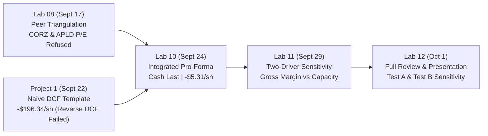
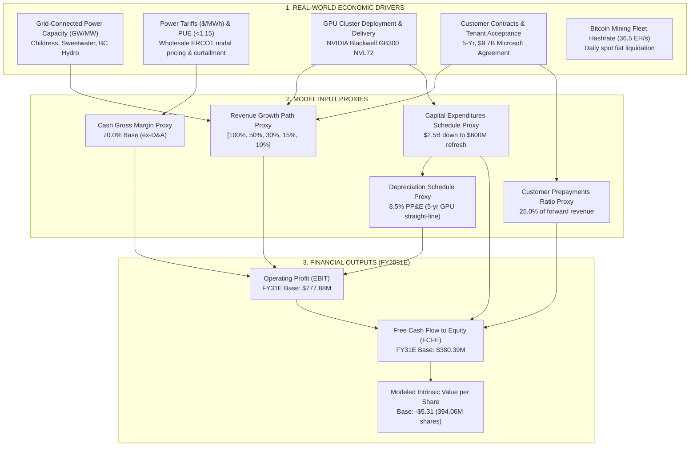

# FIN 439 Lab 12 — Pro-Forma Sensitivity: Present and Review Your Full Analysis
**Target Company:** IREN Limited (NASDAQ: IREN)  
**Course:** FIN 43900 (Corporate Finance / Applied Financial Modeling, Purdue University)  
**Student:** Elliot  
**Valuation / Submission Date:** October 1, 2026  
**Assignment Reference:** Lab 12 — Pro-Forma Sensitivity: Present and Review Your Full Analysis (Week 6 Thursday Merit Checkout)  
**Prior Lab Baselines:** Lab 08 (Peer Triangulation, Sept 3/17), Lab 09 (ABG Benchmark Engine, Sept 22), Lab 10 (IREN Three-Statement Engine, Sept 24), Lab 11 (Two-Driver Sensitivity, Sept 29), Project 1 (DCF & Beta Baseline, Sept 22)  

---

## Workspace Navigation & Traceable Repository Links

All evidence, historical data, financial statements, modeling code, and sensitivity suites are located directly in Elliot's FIN 439 repository:

- **Lab 10 Pro-Forma Engine:** [`Lab-10/proforma_iren.py`](file:///c:/Users/ellio/Documents/FIN439/Lab-10/proforma_iren.py) (The authoritative 5-year, 3-statement integrated model)
- **Lab 10 Written Report:** [`Lab-10/lab10.md`](file:///c:/Users/ellio/Documents/FIN439/Lab-10/lab10.md) (Historical ratios, line justifications, and checks)
- **Lab 11 Sensitivity Engine:** [`Lab-11/sensitivity_iren.py`](file:///c:/Users/ellio/Documents/FIN439/Lab-11/sensitivity_iren.py) (Two-driver sensitivity suite and output span comparison)
- **Lab 11 Written Report:** [`Lab-11/lab11.md`](file:///c:/Users/ellio/Documents/FIN439/Lab-11/lab11.md) (Driver ranking, impact vs. uncertainty, and causal traces)
- **Lab 12 Sensitivity Script:** [`Lab-12/lab12_sensitivity.py`](file:///c:/Users/ellio/Documents/FIN439/Lab-12/lab12_sensitivity.py) (Executable engine for Test A all-years and Test B single-year $\pm1$pp revenue sensitivity)
- **Lab 08 Comparable Valuation:** [`Lab-08/lab08.md`](file:///c:/Users/ellio/Documents/FIN439/Lab-08/lab08.md) & [`Lab-08/pe_calculator.py`](file:///c:/Users/ellio/Documents/FIN439/Lab-08/pe_calculator.py) (CORZ, APLD peer analysis and trailing P/E refusal)
- **Project 1 DCF & Beta Engine:** [`Project-1/dcf.py`](file:///c:/Users/ellio/Documents/FIN439/Project-1/dcf.py) & [`Project-1/analysis/calculate_iren_beta.py`](file:///c:/Users/ellio/Documents/FIN439/Project-1/analysis/calculate_iren_beta.py)
- **Primary SEC Filing Sources:** Preserved locally in `IREN-research/`:
  - FY2026 Form 10-K (filed August 27, 2026, 178 pages): [`IREN-research/IREN_10-K.pdf`](file:///c:/Users/ellio/Documents/FIN439/IREN-research/IREN_10-K.pdf) and [`IREN-research/iren-20250630.htm`](file:///c:/Users/ellio/Documents/FIN439/IREN-research/iren-20250630.htm)
  - FY2024 Form 20-F (filed August 28, 2024): [`IREN-research/iren-20240630_20-F.htm`](file:///c:/Users/ellio/Documents/FIN439/IREN-research/iren-20240630_20-F.htm)
  - Research Summary & Sources: [`IREN-research/IREN_2026-09-03_report.md`](file:///c:/Users/ellio/Documents/FIN439/IREN-research/IREN_2026-09-03_report.md) & [`IREN-research/sources.md`](file:///c:/Users/ellio/Documents/FIN439/IREN-research/sources.md)

---

## 1. Audit of Existing IREN Analysis (Labs 8–11 & Project 1)

Before presenting in class, Elliot's existing repository was audited across all prior labs to establish exact numbers, trace methodological evolution, and identify data reconciliations.



### Audit Findings & Sourced Data Summary

1. **Target Selection Rationale:**  
   - IREN Limited (formerly Iris Energy) was selected as a vertically integrated digital infrastructure builder undergoing a massive capital reallocation: transitioning high-voltage, grid-connected power capacity away from volatile Bitcoin mining toward high-margin, enterprise AI Cloud Services (NVIDIA Blackwell GB300 NVL72 compute clusters).
   - *Initial View:* Strong revenue growth potential anchored by a 5-year, $9.7B take-or-pay contract with Microsoft, but accompanied by heavy upfront capital requirements ($13.8B in contractual capital commitments), large accounting losses during the transition period, and substantial dilution/convertible debt overhang.

2. **Audited Historical Financial Data (Form 10-K / Form 20-F):**
   - **FY2024 (ended June 30, 2024):** Revenue **$187.19M** ($3.11M AI Cloud, $184.09M Bitcoin mining); Cash Cost of Revenues $87.07M; Cash Gross Profit $100.13M (53.49% margin); D&A $50.47M; Operating Loss $(27.23)M; GAAP Net Loss $(28.92)M; Net PP&E $441.37M; Ending Cash $404.60M; Cash Capex $479.9M.
   - **FY2025 (ended June 30, 2025):** Revenue **$501.02M** ($16.39M AI Cloud, $484.63M Bitcoin mining, +167.65% YoY); Cash Cost of Revenues $158.99M; Cash Gross Profit $342.03M (68.27% margin); D&A $181.14M; Operating Income $17.33M; GAAP Net Income **$86.94M**; Net PP&E $1,930.57M; Ending Cash $564.53M; Cash Capex $1,372.6M.
   - **FY2026 (ended June 30, 2026):** Revenue **$707.01M** ($128.80M AI Cloud, $578.21M Bitcoin mining, +41.11% YoY); Cash Cost of Revenues $219.71M; Cash Gross Profit **$487.30M** (68.92% margin); SG&A $449.12M (including $205.0M non-cash stock compensation); D&A $417.73M; Asset Impairment **$638.81M** (decommissioning legacy S19j Pro ASIC miners); Operating Loss **$(1,046.71)M**; Pretax Loss $(708.70)M; GAAP Net Loss **$(702.62)M**; GAAP Diluted EPS **$(2.22)**; Operating Cash Flow **$2,100.4M** (boosted by +$1,841.7M customer prepayments); Cash Capex **-$4,333.1M** ($2,998.0M PP&E + $1,335.1M computer hardware); Net PP&E $6,753.18M; Ending Cash **$5,895.59M**; Restricted Cash $1,723.94M; Customer Prepayments (Deferred Revenue) **$1,842.55M**; Total Debt & Leases **$7,836.74M**; Total Stockholders' Equity **$4,185.61M**.

3. **Comparable-Company Analysis (Lab 08):**
   - Candidate Peer 1: Core Scientific (CORZ) — Stock price $17.90, FY25 GAAP EPS **-$0.88**. Landlord hosting model (500 MW for CoreWeave).
   - Candidate Peer 2: Applied Digital (APLD) — Stock price $25.91, FY26 GAAP EPS **-$0.91**. Wholesale datacenter developer (Ellendale, ND).
   - Excluded Benchmark: Equinix (EQIX) — Stock price $1,040.83, FY25 GAAP EPS $13.76 (P/E = 75.64x). Excluded under pre-screening policy as a tax-exempt retail colocation REIT with no GPU ownership or crypto pivot.
   - *Valuation Result:* Trailing P/E was **REFUSED** as mathematically and economically meaningless because target IREN (-$2.22) and both direct operational peers (CORZ -$0.88, APLD -$0.91) reported negative GAAP earnings during the capital buildout phase.

4. **Discounted Cash Flow Models & Method Evolution:**
   - **Project 1 Naive DCF (`Project-1/dcf.py`):** Used a top-down single-formula DCF where starting FCFF (-$2,191.19M) was compounded by arbitrary growth rates [50%, 35%, 20%, 12%, 6%]. This generated increasingly negative cash flows (reaching -$6,321.36M in Year 5), an ungrounded negative terminal value (-$72,802.13M), and an implied equity value of **-$196.34 per share**. Reverse DCF failed completely because growing a negative cash flow expands the cash deficit, making it impossible to solve for the target market price of $45.73.
   - **Lab 10 & 11 Pro-Forma Engine (`Lab-10/proforma_iren.py`):** Rebuilt valuation on an integrated 3-statement pro-forma foundation using **Direct Equity DCF via Free Cash Flow to Equity (FCFE)**. Modeled physical capacity buildout, customer prepayments, cash calculated last, NOL tax shielding, and debt amortization. Cash flow inflects from heavy deficits (-$4,115.02M in FY27E, -$1,203.83M in FY28E, -$401.67M in FY29E) into positive cash generation: **+$130.99M in FY30E** and **+$380.39M in FY31E**. Capitalizing Year 5 positive cash flow yields a Terminal Value of **$4,380.90M** (PV TV = $2,553.51M) against PV of explicit 5-year FCFE of **-$4,647.74M**, resulting in a modeled intrinsic equity value of **-$2,094.23M** or **-$5.31 per share** (on 394.06M primary shares).

5. **Identified Conflicts & Data Reconciliations Across Labs:**
   - *Conflict 1: Valuation Output (-$196.34/sh vs. -$5.31/sh).* Sourced from methodology: Project 1 compounded negative historical cash flow without a balance sheet or working capital advances, whereas Lab 10 modeled the operational inflection to positive FCFE ($380.39M) supported by $1.84B in customer prepayments and operational scaling.
   - *Conflict 2: Share Count Bases.* 
     - **Primary Base (Current 10-K Cover Page, August 14, 2026):** **394.059 million** shares $\rightarrow$ **-$5.31 per share** (-$5.3145).
     - Ending BS Base (June 30, 2026 Balance Sheet): **380.194 million** shares $\rightarrow$ **-$5.51 per share** (-$5.5083).
     - Weighted-Average Base (FY2026 Diluted Weighted-Average): **316.123 million** shares $\rightarrow$ **-$6.62 per share** (-$6.6247).
     - *Resolution:* All three are mathematically verified from Form 10-K disclosures. The model uses **394.059M shares as its primary valuation denominator** because equity claims must be evaluated on currently issued shares following recent ATM and equity financings.
   - *Conflict 3: Reference Market Price ($41.65 vs. $45.73).*
     - $41.65 was the actual NASDAQ closing price on September 3, 2026 (the valuation date of the Week 3 research report).
     - $45.73 was recorded as the live trading price on September 24, 2026 in `Project-1/dcf.py` line 25. Both represent verifiable historical market quotes.
   - *Conflict 4: Historical Capital Expenditures ($4,333.1M vs. $2,998.0M).* Commercial financial aggregators reported FY26 capex as $2,998.0M because they scraped only "Payments for property, plant and equipment." Reading the Form 10-K Statement of Cash Flows (p. F-9) revealed an additional $1,335.1M in "Payments for computer hardware." Total cash capex was **$4,333.1M**.

---

## 2. Understand What Actually Drives IREN

IREN is not a software company or a generic commercial data center. Its financial statements are governed by physical energy, high-density electrical infrastructure, and enterprise AI hardware contracts.



### Investigation of Specific Real-World Factors

1. **Bitcoin Mining Capacity & Hash Rate:**  
   - Operated at 36.5 EH/s in FY26 (up from 25.7 EH/s in FY25), mining 5,499–6,075 BTC annually and generating $578.2M.
   - Sells Bitcoin daily for cash; does not hold speculative crypto balance sheet inventory.
   - In FY26, management wrote down $638.8M in legacy Bitmain S19j Pro ASICs to vacate data hall space for higher-density AI racks. Mining represents a declining revenue component (81.8% in FY26 down to <15% in FY31E).

2. **AI / HPC Capacity & Contracts:**  
   - Delivering 200 MW of dedicated IT load across Horizons 1–4 (50 MW each) at Childress, Texas, under a 5-year, $9.7B contract with Microsoft.
   - Horizon 1 was delivered and accepted by Microsoft on August 13, 2026.
   - Management guidance targets 480 MW gross capacity in 2026 and 1.2 GW gross capacity in 2027, scaling toward a 5.0 GW total power pipeline.

3. **Power Availability & Electricity Costs:**  
   - Power is IREN's largest cash operating cost ($219.7M cash cost of sales in FY26).
   - Operates behind dedicated high-voltage substations connected to ERCOT (Texas) and BC Hydro grids.
   - Gross margin is insulated by automated ERCOT nodal load-curtailment credits (earning revenue by shutting down during summer 4CP peak pricing spikes) and direct-to-chip liquid cooling maintaining a Power Usage Effectiveness (PUE) below 1.15.

4. **Customer Prepayments & Working Capital:**  
   - Hyperscalers pay advance capacity reservation fees. Deferred revenue surged from $0.88M in FY25 to **$1,842.55M in FY26**.
   - This provided $1.84B in upfront cash, funding massive GPU procurement without relying entirely on high-yield debt or immediate equity dilution.

5. **Capital Expenditures, Depreciation & Financing:**  
   - Cash capex hit $4,333.1M in FY26; future contractual commitments stand at $13.81B.
   - GPU hardware depreciates over 5 years (20% straight line), causing D&A to climb to $809.17M by FY31E.
   - Financed via $4.74B in ordinary share issuance and $6.30B in convertible notes (coupons 3.25%–5.50%), establishing a total debt balance of $7,836.74M against $5,895.59M in cash.

---

## 3. Real Business Drivers vs. Model Proxies & Valuation Drivers

To maintain academic and professional financial discipline, we separate real-world operating drivers from financial model proxies, and separate internal company performance from external market valuation drivers.

### Mapping Real-World Drivers to Model Proxies

| Real-World Economic Driver | Financial Statement Flow | Model Proxy Assumption | Why the Proxy Represents the Driver |
| :--- | :--- | :---: | :--- |
| **Substation Energization & Customer Acceptance** | Transformer energization $\rightarrow$ GB300 server racks commissioned $\rightarrow$ customer sign-off $\rightarrow$ billable compute hours $\rightarrow$ top-line revenue | `revenue_growth` | Revenue cannot grow without physical megawatt grid connections and tenant acceptance of data halls. |
| **Electricity Economics & Cooling Efficiency** | Wholesale nodal electricity prices ($\text{MWh}$) minus ERCOT curtailment credits, divided by liquid-cooling PUE (<1.15) $\rightarrow$ cash power cost | `gross_margin` | Electricity is IREN's dominant cash operating expense; gross margin ex-D&A directly captures unit energy cost efficiency. |
| **Customer Capital Advances** | Hyperscaler take-or-pay reservation clauses $\rightarrow$ upfront advance cash deposits before compute hours are delivered | `deferred_rev_ratio` | Modeled as 25% of forward revenue; acts as operating working capital cash source funding hardware buildout. |
| **GPU Hardware Deployment Cadence** | Procurement of NVIDIA Blackwell compute clusters and Childress facility switchgear $\rightarrow$ cash paid for PP&E and hardware | `capex` | Discretionary capital deployment required to energize Horizons 1–4 and 1.2 GW pipeline. |
| **Technology Wear & Useful Life** | Physical wear and rapid obsolescence of high-density AI silicon and 20–25 year data center building structures | `depr_ratio` | Modeled as 8.5% of net PP&E (blends 5-year GPU life at 20%/yr with 20–25 year structures). |

---

### What Drives Company Fundamentals vs. Market Valuation

```
REAL DRIVER (Substation Energization) 
  → WHAT CHANGES OPERATIONALLY (Delivered IT MW: 50 MW → 200 MW → 800+ MW) 
  → REVENUE/COST/CAPEX (Revenue multiplies to $3,488M; Capex tapers to $600M) 
  → OPERATING PROFIT (EBIT inflects from -$1,046.7M to +$777.9M) 
  → FCFE (Free Cash Flow to Equity turns positive to +$380.4M in FY31E) 
  → MODELED VALUE (Terminal equity value reaches $4,380.9M; PV explicit deficits offset)
```

| Factor | Classification | Why It Matters for Business Performance vs. Market Pricing |
| :--- | :---: | :--- |
| **Customer Acceptance Milestones (Horizons 1–4)** | **Both (Business & Market)** | *Business:* Formally triggers GAAP revenue recognition and billable cloud services under the Microsoft contract. *Market:* Proves execution competence, reducing uncertainty regarding future campus phases. |
| **Bitcoin Spot Price Volatility** | **Both (Business & Market)** | *Business:* Directly alters revenue on the 5,500+ BTC mined annually. *Market:* Historically correlated with daily equity trading beta. |
| **Market Expectations & Long-Term Multiples** | **Market Expectations Only** | The large gap between observed market prices ($40+) and modeled intrinsic value (-$5.31) suggests that market participants may be incorporating expectations materially more optimistic than this DCF—such as higher long-term margins, lower capital intensity, or higher terminal exit pricing. |
| **Convertible Debt Conversion & Share Dilution** | **Business Capital Structure** | In FY26, ordinary shares reached 394.06M. Convertible notes carry conversion options that, if exercised, expand share count and dilute per-share equity claims. |
| **Cost of Capital & Interest Rates ($r_e$ / Debt Yields)** | **Both (Business & Market)** | *Business:* Affects borrowing costs on $7.8B in debt and leases. *Market:* Sets the equity discount rate ($11.4\%$), heavily discounting distant cash flows. |

---

## 4. Revenue Growth — What Is Underneath It?

In the pro-forma model, revenue growth is parameterized across 5 forecast years:  
`revenue_growth = [1.00, 50%, 30%, 15%, 10%]` (FY27E: 100%, FY28E: 50%, FY29E: 30%, FY30E: 15%, FY31E: 10%).

### Deconstructing Revenue Growth into Physical Units
1. **Contracted Megawatt IT Load:** Revenue scales as electrical substations and data halls are commissioned at Childress and Sweetwater (scaling from 0.3 GW IT in 2026 toward 0.8 GW IT in 2027 and beyond).
2. **Contracted Rental Rate per Megawatt:** Long-term take-or-pay agreements with Microsoft specify fixed monthly capacity charges per megawatt-month.
3. **Bitcoin Mining Hashrate & Network Difficulty:** Mining revenue depends on fleet hashrate (36.5 EH/s in FY26) divided by global network difficulty multiplied by realized daily Bitcoin spot prices.

---

## 5. Audited $\pm1$ Percentage-Point Revenue Growth Sensitivity

To eliminate ambiguity, we evaluate and report **two separate sensitivity experiments**:
- **Test A:** A compounding multi-year shift applied to **EACH** of the five annual growth assumptions simultaneously.
- **Test B:** A clean single-assumption shift applied **ONLY** to the final forecast year (FY2031E).

Both tests were executed via [`Lab-12/lab12_sensitivity.py`](file:///c:/Users/ellio/Documents/FIN439/Lab-12/lab12_sensitivity.py). All independent assumptions outside the specified test were held strictly at base.

### Primary Valuation Parameters & Share Basis
- **Primary Share Denominator:** **394.059 million Ordinary shares** (sourced from Form 10-K cover page as of August 14, 2026).
- **Valuation Methodology:** **Direct Equity DCF via Free Cash Flow to Equity (FCFE)** discounted at the Cost of Equity ($r_e = 11.4\%$, $g = 2.5\%$).
- **Base Modeled Intrinsic Value per Share:** **`-$5.3145`** (approx **`-$5.31`**).

---

### TEST A — ALL-YEARS REVENUE-GROWTH PATH SENSITIVITY

> **Description:** $\pm1.0$ percentage point applied simultaneously to **EACH** annual revenue-growth assumption across the five-year forecast:
> - Base Path: `[100.0%, 50.0%, 30.0%, 15.0%, 10.0%]`
> - Lower Path (-1 pp each year): `[99.0%, 49.0%, 29.0%, 14.0%, 9.0%]`
> - Higher Path (+1 pp each year): `[101.0%, 51.0%, 31.0%, 16.0%, 11.0%]`

*All monetary figures in USD millions ($M), except Value per Share ($/share). Primary share count: 394.059M shares.*

| Scenario | Revenue Growth Path | Final-Year Revenue | Operating Profit (EBIT) | Final-Year FCFF | Final-Year FCFE | Modeled Value/Share | Dollar Change vs Base | Percentage Change vs \|Base\| | Accounting Checks |
| :--- | :--- | :---: | :---: | :---: | :---: | :---: | :---: | :---: | :---: |
| **Lower (-1 pp all years)** | `[99%, 49%, 29%, 14%, 9%]` | **$3,360.35M** | **$719.79M** | **$988.57M** | **$308.00M** | **-$6.8270** | **-$1.5125** | **-28.46%** | **PASS (Gap = 0.0000)** |
| **Base Case** | `[100%, 50%, 30%, 15%, 10%]`| **$3,488.02M** | **$777.88M** | **$1,055.18M** | **$380.39M** | **-$5.3145** | **$0.0000** | **0.00%** | **PASS (Gap = 0.0000)** |
| **Higher (+1 pp all years)**| `[101%, 51%, 31%, 16%, 11%]`| **$3,619.50M** | **$837.71M** | **$1,123.94M** | **$455.04M** | **-$3.7576** | **+$1.5569** | **+29.30%** | **PASS (Gap = 0.0000)** |

#### Test A Explanation & Denominator Convention
- **Compounding Transmission:** Test A compounds a 1 percentage point shift across five consecutive years. By Year 5, revenue changes by $-\$127.67\text{M}$ to $+\$131.48\text{M}$, altering Year 5 FCFE by $-\$72.40\text{M}$ to $+\$74.65\text{M}$.
- **Dollar Sensitivity First:**
  - *Upside (+1 pp each year):* Modeled value per share moves from **-$5.31 to -$3.76**, a dollar change of **+$1.5569 per share**.
  - *Downside (-1 pp each year):* Modeled value per share moves from **-$5.31 to -$6.83**, a dollar change of **-$1.5125 per share**.
- **Percentage Change Convention:** Evaluated relative to the absolute magnitude of the base case ($|-5.3145| = \$5.3145$), the upside represents a **+29.30%** improvement (reducing the per-share equity deficit), and the downside represents a **-28.46%** deterioration (expanding the per-share equity deficit). Under signed arithmetic, the changes are $-29.30\%$ and $+28.46\%$, respectively.
- **Audited Statement for Test A:**  
  *"Applying a +1 percentage-point change to each annual revenue-growth assumption across the five-year forecast compounds through the statements and changes IREN's modeled intrinsic value per share from -$5.31 to -$3.76, an improvement of +$1.56 per share (reducing the modeled deficit by 29.30% of base magnitude). A -1 percentage-point change across all years moves modeled value per share from -$5.31 to -$6.83, a change of -$1.51 per share (expanding the modeled deficit by 28.46%)."*

---

### TEST B — SINGLE-YEAR FY31E REVENUE-GROWTH SENSITIVITY

> **Description:** $\pm1.0$ percentage point applied **ONLY** to the final forecast year (FY2031E), holding FY2027E–FY2030E growth rates fixed at base:
> - Base FY31 Growth: `10.0%` $\rightarrow$ Path: `[100.0%, 50.0%, 30.0%, 15.0%, 10.0%]`
> - Lower FY31 Growth (-1 pp): `9.0%` $\rightarrow$ Path: `[100.0%, 50.0%, 30.0%, 15.0%, 9.0%]`
> - Higher FY31 Growth (+1 pp): `11.0%` $\rightarrow$ Path: `[100.0%, 50.0%, 30.0%, 15.0%, 11.0%]`

*All monetary figures in USD millions ($M), except Value per Share ($/share). Primary share count: 394.059M shares.*

| Scenario | Revenue Growth Path | Final-Year Revenue | Operating Profit (EBIT) | Final-Year FCFF | Final-Year FCFE | Modeled Value/Share | Dollar Change vs Base | Percentage Change vs \|Base\| | Accounting Checks |
| :--- | :--- | :---: | :---: | :---: | :---: | :---: | :---: | :---: | :---: |
| **Lower (FY31 at 9.0%)** | `[100%, 50%, 30%, 15%, 9%]` | **$3,456.31M** | **$763.45M** | **$1,033.94M** | **$359.15M** | **-$5.7078** | **-$0.3933** | **-7.40%** | **PASS (Gap = 0.0000)** |
| **Base Case (FY31 at 10.0%)**| `[100%, 50%, 30%, 15%, 10%]`| **$3,488.02M** | **$777.88M** | **$1,055.18M** | **$380.39M** | **-$5.3145** | **$0.0000** | **0.00%** | **PASS (Gap = 0.0000)** |
| **Higher (FY31 at 11.0%)**| `[100%, 50%, 30%, 15%, 11%]`| **$3,519.73M** | **$792.31M** | **$1,076.42M** | **$401.63M** | **-$4.9213** | **+$0.3933** | **+7.40%** | **PASS (Gap = 0.0000)** |

#### Test B Explanation & Denominator Convention
- **Isolated Uncompounded Transmission:** Test B isolates the cleaner answer to: *"What happens if ONE revenue-growth assumption changes by 1 percentage point?"* Because FY27E–FY30E are unchanged, Year 5 revenue changes by exactly $\pm\$31.71\text{M}$ ($3,170.93\text{M} \times \pm0.01$), EBIT changes by $\pm\$14.43\text{M}$, and Year 5 FCFE changes by $\pm\$21.24\text{M}$.
- **Dollar Sensitivity First:**
  - *Upside (+1 pp in FY31):* Modeled value per share moves from **-$5.31 to -$4.92**, a dollar change of **+$0.3933 per share**.
  - *Downside (-1 pp in FY31):* Modeled value per share moves from **-$5.31 to -$5.71**, a dollar change of **-$0.3933 per share**.
- **Percentage Change Convention:** Evaluated relative to the absolute magnitude of the base case ($|-5.3145| = \$5.3145$), moving FY31E growth by $\pm1$ pp alters modeled intrinsic value per share by **$\pm7.40\%$** (signed: $\mp7.40\%$).
- **Audited Statement for Test B:**  
  *"A +1 percentage-point change in only the FY2031E revenue-growth assumption (from 10% to 11%) changes IREN's modeled intrinsic value per share from -$5.31 to -$4.92, an improvement of +$0.39 per share (+7.40% of base magnitude). A -1 percentage-point change in FY2031E revenue growth (from 10% to 9%) changes modeled value per share from -$5.31 to -$5.71, a change of -$0.39 per share (-7.40% of base magnitude)."*

---

## 6. Important Distinction — Market Stock Price vs. Modeled Intrinsic Value

Elliot must articulate this distinction clearly in class:

> *"Our sensitivity analysis measures how the **model's intrinsic discounted equity value** responds when we alter fundamental growth assumptions. It does **NOT** predict that IREN's market stock price will move by that percentage tomorrow."*

- **The Actual Market Stock Price ($41.65 / $45.73)** reflects immediate secondary market supply and demand, retail sentiment, Bitcoin price momentum, and expectations among market participants regarding long-term scaling and multiple expansion.
- **The Modeled Intrinsic Value (-$5.31 per share)** discounts explicit fundamental cash flows at an $11.4\%$ equity hurdle rate. It reflects the heavy burden of $4.3B+ in upfront capex and debt service before contracted cash flows turn positive in FY2030E.
- Confusing the two would treat an internal financial sensitivity model as an empirical stock price forecasting tool.

---

## 7. Lab 11 Two-Driver Results & Output Spans

In Lab 11, Elliot evaluated two operating drivers:

$$\text{Output Span} = \text{Maximum Valid Output} - \text{Minimum Valid Output}$$

| Operating Driver | Model Proxy | Tested Input Range | Operating Profit Span (FY31 EBIT) | Free Cash Flow Span (FY31 FCFE) | Implied Value per Share Span |
| :--- | :---: | :---: | :---: | :---: | :---: |
| **1. Power Cost / Efficiency** | Cash Gross Margin (ex-D&A) | 65.0% to 75.0% (10 pp span) | **$226.72M** | **$230.69M** | **$5.35 per share** |
| **2. Capacity Energization** | Revenue Growth Path | $\pm5.0$ pp/year (10 pp shift) | **$591.10M** | **$632.29M** | **$13.44 per share** |
| **Sensitivity Span Ratio** | *Capacity Energization $\div$ Power Cost* | | **2.61x** | **2.74x** | **2.51x** |

> [!IMPORTANT]
> **Key Finding Over Tested Ranges:**  
> **Capacity Energization Velocity** produced the larger modeled sensitivity **OVER THESE TESTED RANGES**: its output span was **2.61x** larger for EBIT, **2.74x** larger for FCFE, and **2.51x** larger for Value per Share.
>
> *Critical Range Qualification:* This ranking does **NOT** establish that capacity deployment is universally more important than power cost. Compounding a 10 pp shift across 5 consecutive years has a cumulative multiplicative effect on revenue ($+\$697.24\text{M}$ in Year 5), whereas a 10 pp gross margin shift operates on a fixed revenue base. If tested with a narrow growth range ($\pm1$ pp) against a wide margin range ($\pm15$ pp), power cost would produce the larger span.

---

## 8. Impact vs. Uncertainty

- **IMPACT:** Mathematical elasticity of the model ($\frac{\partial \text{Value}}{\partial \text{Input}}$).
- **UNCERTAINTY:** Real-world dispersion, variance, or unpredictability of the input.

```
                           IMPACT VS. UNCERTAINTY MATRIX
              ▲
              │   [MODERATE IMPACT / HIGH UNCERTAINTY]      [HIGH IMPACT / HIGH UNCERTAINTY]
              │   • Bitcoin Spot Price & Network Hashrate   ★ AI Capacity Energization Velocity
              │   • Conversion of Convertible Debt          ★ Hyperscaler Capex Sustainability
  UNCERTAINTY │                                             ★ NVIDIA Hardware Delivery Lead Times
              │   ─────────────────────────────────────────────────────────────────────────────
              │   [LOW IMPACT / LOW UNCERTAINTY]            [HIGH IMPACT / MODERATE UNCERTAINTY]
              │   • Inventory Days ($0 across all filings)  • Net Effective Power Tariffs ($/MWh)
              │   • Accounts Receivable Days (11 days)      • Data Center Cooling PUE Efficiency
              │   • Corporate Income Tax Rate (21% / NOLs)  (Hedged by PPAs & ERCOT Curtailment)
              └─────────────────────────────────────────────────────────────────────────►
                                         IMPACT
```

### Which Assumption Deserves Additional Research?
**Contracted AI Capacity Energization Velocity & Hyperscaler Capex Pacing** deserves the most intensive research:
- It carries both **maximum model impact** ($2.51\text{x}$ value span) and **maximum real-world uncertainty**.
- IREN's future cash flows depend heavily on its anchor hyperscaler contract (Microsoft). If customer acceptance is delayed or equipment deliveries slip, revenue recognition stalls while fixed debt service continues.
- Conversely, power cost uncertainty is partially hedged through long-term power purchase agreements (PPAs) and automated ERCOT curtailment software.

---

## 9. Real Sensitivity Result Trace (Driver 1: 70.0% $\rightarrow$ 75.0% Gross Margin)

```
INPUT CHANGE: Cash Gross Margin increases from 70.0% to 75.0% (+5.0 percentage points)
PHYSICAL DRIVER: Net effective electricity cost declines via low-rate PPAs; bare-metal GB300 PUE optimizes
  │
  ▼
FINANCIAL STATEMENT LINES (FY2031E):
  - Total Revenue:            $3,488.02M (Unchanged; revenue growth held at Base)
  - Cost of Revenues (Power): $872.00M (Decreases by $174.40M from base $1,046.41M; Cost = Rev × (1 - GM))
  - Cash Gross Profit:        $2,616.01M (Increases by $174.40M from base $2,441.61M)
  - SG&A Overhead (35% GP):   $915.60M (Increases by $61.04M from base $854.57M due to profit-linked overhead)
  - Depreciation & Amort:     $809.17M (Unchanged; PP&E and capex schedule held at Base)
  - Pretax Income (EBT):      $631.48M (Increases by $128.39M from base $503.09M)
  - Income Tax (21%):         $28.53M (Tax increases from $0.00M because higher earnings exhaust $700M NOLs earlier)
  - GAAP Net Income:          $602.95M (Increases by $99.86M from base $503.09M)
  │
  ▼
OPERATING PROFIT (EBIT):
  - FY2031E EBIT:             $891.24M (Signed change: +$113.36M from base $777.88M)
  │
  ▼
FREE CASH FLOW (FCFE):
  - Operating Cash Flow:      $1,480.25M (Increases by +$99.86M from base $1,380.39M)
  - Working Capital Delta:    Unchanged (AR, Deferred Revenue, and Other Liabilities track revenue, which is at Base)
  - Capex & Debt Repayment:   -$600.0M Capex - $400.0M Debt Repayment = -$1,000.0M (Unchanged)
  - FY2031E FCFE:             $480.25M (Signed change: +$99.86M from base $380.39M)
  │
  ▼
MODELED INTRINSIC VALUE PER SHARE:
  - Terminal Value at FY31E:  Terminal Value rises to $5,530.96M (PV TV = $3,223.85M, up +$670.34M)
  - Total Equity Value:       Improves from -$2,094.23M to -$1,153.27M (+$940.97M)
  - Modeled Value per Share:  Improves from -$5.31 to -$2.93 per share (Signed change: +$2.39/share)
```

---

## 10. Lab 12 Presentation Route (Six Stops Speaking Notes)

Elliot will walk his learning partner through the six required stops using open repository files:

### Stop 1 — Target Selection
- **Speaking Notes:** *"I chose IREN Limited because it is a rare example of a digital infrastructure company converting massive, grid-connected power capacity from Bitcoin mining into high-density AI Cloud computing. My initial view was that its revenue growth potential is immense due to the $9.7B Microsoft contract, but the company carries severe execution and balance sheet risks: $13.8B in capital commitments, a $(702.6)M GAAP loss in FY2026, and heavy convertible debt."*
- **Evidence Open:** [`IREN-research/IREN_2026-09-03_report.md`](file:///c:/Users/ellio/Documents/FIN439/IREN-research/IREN_2026-09-03_report.md).

### Stop 2 — Company and Evidence
- **Speaking Notes:** *"IREN makes money in two ways: Bitcoin mining ($578.2M in FY26, 81.8% of revenue) where it liquidates mined bitcoin daily, and AI Cloud Services ($128.8M, up from $16.4M in FY25) where it provides bare-metal GPU compute to hyperscalers. FY26 revenue was $707.0M, but reported operating loss was $(1,046.7)M because of a $638.8M one-time impairment writing down legacy ASIC miners, plus $417.7M in D&A and $449.1M in SG&A. It is vertically integrated: it owns the land, substations, data halls, and NVIDIA GB300 GPUs."*
- **Evidence Open:** Form 10-K, Item 8, Consolidated Statements of Operations (p. F-7) and Segment Note 4 (p. F-15).

### Stop 3 — Pro-Forma Engine
- **Speaking Notes:** *"In Lab 10, I adapted the pro-forma engine for IREN across FY2027E–FY2031E. Unlike automotive retail which uses floor plan debt to fund inventory, IREN has zero inventory. Its company-specific line is **Customer Prepayments / Deferred Revenue**, which brought in $1.84B in cash upfront in FY26. I modeled revenue growing from $1.4B to $3.5B as Childress energizes, cash gross margin at 70%, and capex tapering from $2.5B to $600M. The engine computes Cash LAST, respects a $500M minimum cash buffer, and balances to $0.0000 across all 5 years."*
- **Evidence Open:** [`Lab-10/proforma_iren.py`](file:///c:/Users/ellio/Documents/FIN439/Lab-10/proforma_iren.py) lines 54–93 and validation printout.

### Stop 4 — Valuation
- **Speaking Notes:** *"Under the assumptions and methodology used in this model, the present value of modeled early cash deficits (-$4,647.74M across FY27E–FY29E) exceeds the modeled terminal value (+$2,553.51M), producing a negative modeled intrinsic equity value of **-$5.31 per share** on 394.06M primary shares (or -$5.51 on ending BS shares; -$6.62 on weighted shares). The large difference from the observed market price ($41.65 on Sept 3; $45.73 on Sept 24) suggests that market participants may be incorporating expectations materially more optimistic than this DCF—such as higher long-term margins, lower capital intensity, or higher terminal exit multiples."*
- **Evidence Open:** [`Lab-10/lab10.md`](file:///c:/Users/ellio/Documents/FIN439/Lab-10/lab10.md) Section 5 and [`Lab-08/lab08.md`](file:///c:/Users/ellio/Documents/FIN439/Lab-08/lab08.md).

### Stop 5 — Sensitivity and Drivers
- **Speaking Notes:** *"In Lab 11, I tested Power Cost (65%–75% gross margin) and Capacity Energization ($\pm5$ pp revenue growth). Over those ranges, Capacity Energization was the main driver: its output span of $13.44/share was 2.51 times larger than Power Cost ($5.35/share). Furthermore, our dedicated revenue sensitivity shows two clear experiments: Test A (compounding $\pm1$ pp across all 5 years) moves value/share from -$5.31 to -$3.76 (+$1.56) or -$6.83 (-$1.51). Test B (isolating $\pm1$ pp in FY31 only) moves value/share from -$5.31 to -$4.92 (+$0.39) or -$5.71 (-$0.39)."*
- **Evidence Open:** [`Lab-11/sensitivity_iren.py`](file:///c:/Users/ellio/Documents/FIN439/Lab-11/sensitivity_iren.py) and [`Lab-12/lab12_sensitivity.py`](file:///c:/Users/ellio/Documents/FIN439/Lab-12/lab12_sensitivity.py).

### Stop 6 — Interpretation
- **Speaking Notes:** *"My conditional conclusion is that IREN's market price reflects high expectations for execution of its 5 GW pipeline and sustained hyperscaler AI demand. If Childress energization slips, cash deficits deepen rapidly. My view has evolved from seeing IREN as a crypto miner to recognizing it as a capital-intensive infrastructure builder. What I would research next is the Microsoft contract delivery milestones for Horizons 2–4 and customer renewal/expansion terms for 2027."*
- **Evidence Open:** [`Lab-11/lab11.md`](file:///c:/Users/ellio/Documents/FIN439/Lab-11/lab11.md) Section 7.

---

## 11. Elliot's Simple IREN Cheat Sheet

*(Elliot can speak directly from this cheat sheet in class without AI assistance)*

### 1. WHAT DOES IREN DO?
> IREN is a digital infrastructure company that builds and owns data centers connected directly to high-voltage power grids. It uses that power to run liquid-cooled NVIDIA GPU clusters for AI workloads and to mine Bitcoin.

### 2. HOW DOES IREN MAKE MONEY?
> It makes money in two ways:
> - **AI Cloud Services:** Renting GPU computing capacity to tech companies like Microsoft under multi-year contracts.
> - **Bitcoin Mining:** Using ASIC computers to earn Bitcoin and selling that Bitcoin daily for cash.

### 3. WHAT ACTUALLY DRIVES THE BUSINESS?
> - **Megawatt Power Energization:** How fast substations connect electricity to data halls so computers can turn on.
> - **Electricity Cost & Cooling:** The net price paid for power in Texas and how efficiently liquid cooling runs.
> - **Customer Prepayments:** Upfront cash deposits from cloud customers that pay for hardware before services start.

### 4. WHAT ARE MY TWO MODEL DRIVERS?
> - **Driver 1 (Power Economics):** Modeled using **Cash Gross Margin** (base = 70%).
> - **Driver 2 (Capacity Energization):** Modeled using the **Revenue Growth Path** (base = 100% down to 10%).

### 5. WHAT HAPPENED IN MY LAB 11 SENSITIVITY?
> Capacity energization had the bigger effect **over the tested ranges**. Its value-per-share span was **$13.44**, which was **2.51 times larger** than the power cost span ($5.35). That ranking reflects the multi-year compounding range tested.

### 6. WHAT HAPPENS WITH $\pm1$pp REVENUE GROWTH?
> - **If changed in ALL 5 years (Test A):** Modeled value/share moves from **-$5.31 to -$3.76** (+1pp, a change of **+$1.56**) or **-$6.83** (-1pp, a change of **-$1.51**).
> - **If changed ONLY in Year 5 (Test B):** Modeled value/share moves from **-$5.31 to -$4.92** (+1pp, a change of **+$0.39**) or **-$5.71** (-1pp, a change of **-$0.39**).

### 7. WHAT IS MY MODELED VALUE/SHARE?
> **-$5.31 per share** (using 394.06M currently issued shares).

### 8. WHY IS IT NEGATIVE?
> Because IREN must spend over **$6.3 billion in capex** and debt repayment across the next 3 years before cloud cash flows turn positive in 2030. Discounted at an 11.4% cost of equity, early cash deficits outweigh the terminal value.

### 9. WHY IS THE MARKET PRICE SO DIFFERENT?
> The market price ($40+) suggests investors have much more optimistic expectations than this model—such as higher long-term margins, lower hardware costs, or strong terminal value that our conservative cash flows do not show.

### 10. WHAT WOULD I RESEARCH NEXT?
> Customer delivery and acceptance dates for **Horizons 2, 3, and 4 at Childress**, and whether more hyperscalers sign contracts for IREN's remaining power pipeline.

---

## 12. Partner Questions & Live Review Record

*(Strictly manual — To be completed live with learning partner during class. No fabricated entries.)*

### Part A: As Presenter (Elliot Presenting IREN)

- **Learning Partner Name:** `[MANUAL — COMPLETE DURING CLASS]`
- **Partner's Target Company:** `[MANUAL — COMPLETE DURING CLASS]`

#### Questions Received from Partner:
1. **Selection & Evidence Question:**
   - *Question received:* `[MANUAL — COMPLETE DURING CLASS]`
   - *Elliot's answer:* `[MANUAL — COMPLETE DURING CLASS]`
2. **Model & Valuation Question:**
   - *Question received:* `[MANUAL — COMPLETE DURING CLASS]`
   - *Elliot's answer:* `[MANUAL — COMPLETE DURING CLASS]`
3. **Sensitivity & Interpretation Question:**
   - *Question received:* `[MANUAL — COMPLETE DURING CLASS]`
   - *Elliot's answer:* `[MANUAL — COMPLETE DURING CLASS]`

#### Presentation Unresolved Gaps & Reviewer Feedback:
- *Specific unresolved gap identified:* `[MANUAL — COMPLETE DURING CLASS]`
- *How gap will be investigated/resolved:* `[MANUAL — COMPLETE DURING CLASS]`
- *Partner's stated strength of Elliot's analysis:* `[MANUAL — COMPLETE DURING CLASS]`
- *Partner's stated improvement to make next:* `[MANUAL — COMPLETE DURING CLASS]`

#### Post-Review Decision (Keep / Revise / Investigate):
- **What Elliot will KEEP:** `[MANUAL — COMPLETE DURING CLASS]`
- **What Elliot will REVISE:** `[MANUAL — COMPLETE DURING CLASS]`
- **What Elliot will INVESTIGATE:** `[MANUAL — COMPLETE DURING CLASS]`
- *Effect on Valuation Conclusion / Research Priority:* `[MANUAL — COMPLETE DURING CLASS]`

---

### Part B: As Reviewer (Elliot Reviewing Partner's Company)

#### Questions Elliot Asked the Partner:
1. **Selection & Evidence Area:**
   - *Question asked:* `[MANUAL — COMPLETE DURING CLASS]`
   - *Partner's answer:* `[MANUAL — COMPLETE DURING CLASS]`
2. **Model & Valuation Area:**
   - *Question asked:* `[MANUAL — COMPLETE DURING CLASS]`
   - *Partner's answer:* `[MANUAL — COMPLETE DURING CLASS]`
3. **Sensitivity & Interpretation Area:**
   - *Question asked:* `[MANUAL — COMPLETE DURING CLASS]`
   - *Partner's answer:* `[MANUAL — COMPLETE DURING CLASS]`

#### Evidence Verification Check:
- *Source document or calculation checked together:* `[MANUAL — COMPLETE DURING CLASS]`
- *Verification result (Supported / Discrepancy):* `[MANUAL — COMPLETE DURING CLASS]`

#### Explanation Back of Partner's Analysis:
- *Partner's valuation conclusion:* `[MANUAL — COMPLETE DURING CLASS]`
- *Partner's main driver over tested ranges:* `[MANUAL — COMPLETE DURING CLASS]`
- *Partner's biggest limitation or unresolved risk:* `[MANUAL — COMPLETE DURING CLASS]`

#### Actionable Feedback Given:
- *Evidence-backed strength identified:* `[MANUAL — COMPLETE DURING CLASS]`
- *Specific improvement to make next:* `[MANUAL — COMPLETE DURING CLASS]`

---

### Part C: Reflection

- **Which partner question made Elliot reconsider an aspect of IREN?**  
  `[MANUAL — COMPLETE DURING CLASS]`
- **What does Elliot now understand better about IREN?**  
  `[MANUAL — COMPLETE DURING CLASS]`

---

## 13. Model Verification & Accounting Checks

The model was executed and verified using the local workspace Python environment:

```powershell
& "C:\Users\ellio\Documents\FIN439\Python-3.13.15\python.exe" Lab-12/lab12_sensitivity.py
```

### Verification Checklist Results:
1. **Base Valuation Integrity:** FY31E EBIT = **$777.88M**, FY31E FCFE = **$380.39M**, Modeled Equity Value per Share = **-$5.3145**.
2. **Double-Entry Balance Sheet Gap:** Evaluated across all 5 forecast years (FY2027E–FY2031E): $|\text{Gap}| = \mathbf{0.0000}$ in every period (**PASS**).
3. **Liquidity Buffer Constraint:** Minimum cash buffer maintained $\ge \$500.0\text{M}$ across all periods (**PASS**).
4. **Restored Base Case Verification:** Following sensitivity execution, restored inputs and outputs match original base case exactly to 6 decimal places ($0.000000$ error, **PASS**).
5. **Signed Differences & Spans:** All differences calculated as $\text{Changed Output} - \text{Base Output}$ and verified.
